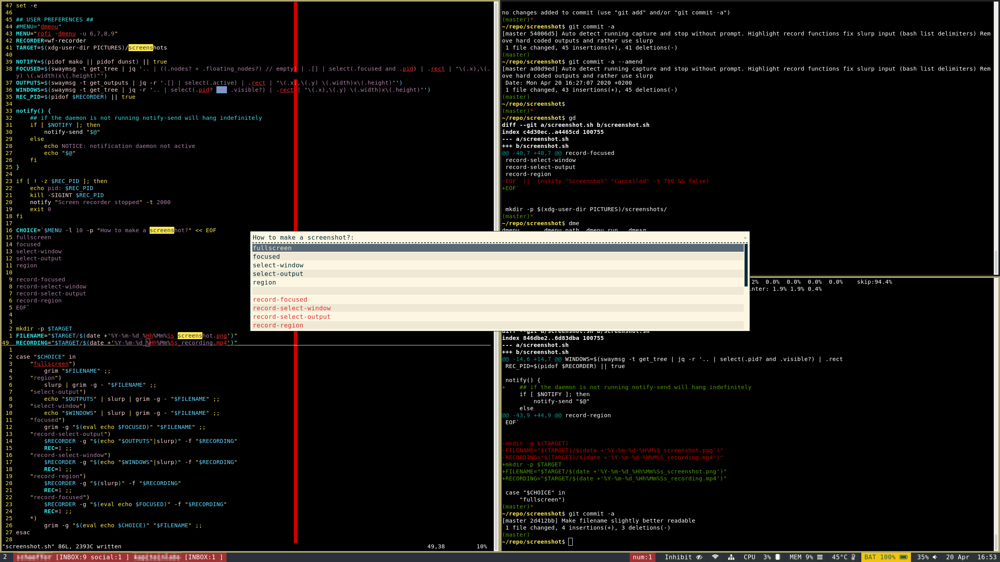

This script opens dmenu/rofi and presents the user with some screenshot
options.  On selection it saves the screenshot in the ~/Pictures directory (or
whatever is defined by XDG). It then copies the image to the clipboard and opens it in
feh.

It can also be used to make screen recordings. Running the script a second
time will stop any current recording.

dependencies:
 - feh
 - grim
 - slurp
 - dmenu or rofi
 - jq
 - wf-recorder
 - wl-clipboard
 - libnotify-bin
 - dunst or mako

Example Sway configuration:

bindsym Print exec ~/.config/sway/screenshot.sh

