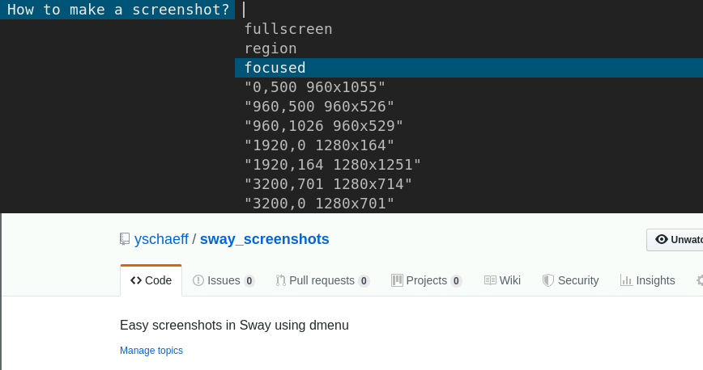

This script opens dmenu and presents the user with some screenshot options.
On selection it saves the screenshot in the ~/Pictures directory. Copies the 
image to the clipboard and opens it in feh.

dependencies:
 - feh
 - grim
 - slurp
 - jq
 - wf-recorder
 - wl-clipboard

Example Sway configuration:

bindsym Print exec ~/.config/sway/screenshot.sh

